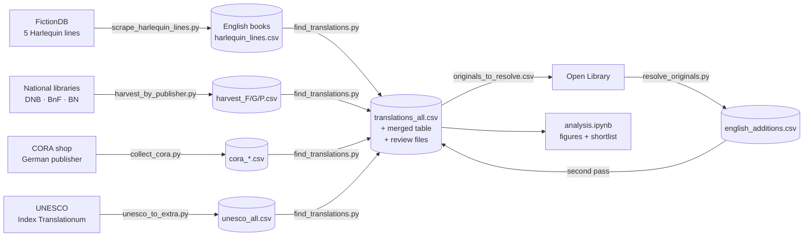

# Harlequin Translations

# Harlequin translations: linking English category romances to their French, German and Polish editions

A reproducible pipeline that builds a metadata table of English-language Harlequin/Silhouette
category romances and links each book to its **French, German and Polish translations**, with
publication data, publishers, series, translators and stable edition IDs. It was built to select
parallel texts for a translation/alignment study, but the tables are useful for any
quantitative work on popular-fiction translation.

The pipeline works **translation-first**: instead of searching for translations of a fixed list of
English books, it harvests *every* Harlequin translation the national libraries hold and then
identifies the English original of each one.



---

## Contents

1. [Repository contents](#repository-contents)
2. [Installation](#installation)
3. [Quick start](#quick-start)
4. [The pipeline step by step](#the-pipeline-step-by-step)
5. [How matching works](#how-matching-works)
6. [Output files](#output-files)
7. [Results of the September 2026 run](#results-of-the-september-2026-run)
8. [Known limitations](#known-limitations)
9. [Negative result: linking by series order](#negative-result-linking-by-series-order)
10. [Data sources and responsible use](#data-sources-and-responsible-use)
11. [Development history](#development-history)

---

## Repository contents

| File | Purpose |
|---|---|
| `scrape_harlequin_lines.py` | English side: scrapes the complete lists of Harlequin American Romance, Harlequin Presents, Harlequin Romance, Silhouette Desire and Special Edition from FictionDB (optionally each book's detail page). |
| `harvest_by_publisher.py` | Harvests all Harlequin translations from the German (DNB), French (BnF) and Polish (BN) national libraries by **publisher**. |
| `collect_cora.py` | Collects German editions from the CORA Verlag shop (the German Harlequin publisher), whose product pages name original title and translator for every story. |
| `unesco_to_extra.py` | Converts the open UNESCO *Index Translationum* sample into the pipeline's extra-source format. |
| `find_translations.py` | **Core.** Matches translations to English books, assigns edition IDs, writes the translation tables, the review files and the list of unresolved originals. Also holds the shared parsing/matching functions imported by the other scripts. |
| `resolve_originals.py` | Looks up English originals that are not in the scraped lines on Open Library and adds them if they are Harlequin-family books. |
| `analysis.ipynb` | Analysis and figures: corpus overview, coverage per language and line, translation lag, publishers, translators, quality checks, shortlist of books available in several languages. |
| `experiments/anchor_candidates.py` | Documented **negative result**: an attempt to link records without original title via series order (see below). Not part of the pipeline. |
| `requirements.txt`, `.gitignore` | Dependencies; keeps caches and data files out of the repository. |

All scripts must stay in the same folder (they import from `find_translations.py`). Run them from
the folder where you want the data files to be written.

---

## Installation

Python 3.10+.

```bash
git clone <this repository>
cd harlequin-translations
python -m venv .venv && source .venv/bin/activate      # optional
pip install -r requirements.txt
```

No API keys are needed. All sources are public web pages or open APIs.

---

## Quick start

Test runs that finish in minutes:

```bash
python scrape_harlequin_lines.py --lines american_romance          # 1,713 English books
python harvest_by_publisher.py --langs P                            # Polish translations (~10 min)
python find_translations.py harlequin_lines.csv --no-library --langs P \
    --extra harvest_P.csv -o translations_P.csv --merged merged_P.csv \
    --unmatched unmatched_P.csv --candidates candidates_P.csv
```

---

## The pipeline step by step

Every script **caches** each downloaded page (`cache/`, `cache_harvest/`, `cache_cora/`,
`cache_translations/`, `cache_openlibrary/`). Any step can be stopped and restarted; re-running
after a code change only re-parses the cached pages. On macOS, prefix long runs with
`caffeinate -i` to keep the machine awake.

### Step 1: English books (FictionDB)

```bash
python scrape_harlequin_lines.py                    # all five lines, list pages only (~5 min)
python scrape_harlequin_lines.py --details          # + every book page: rating, ISBN, pages, description (~7 h)
python scrape_harlequin_lines.py --lines presents desire   # a subset
```

| Line | Books (2026) |
|---|---|
| Harlequin American Romance | 1,713 |
| Harlequin Presents | 4,508 |
| Harlequin Romance | 5,031 |
| Silhouette Desire | 3,001 |
| Special Edition (Silhouette/Harlequin) | 3,200 |

A book listed in several lines is kept once; `line` is the first line it was found in, `all_lines`
lists every membership (`"Silhouette Desire #812; Harlequin Presents #1590"`).
`is_anthology` marks stories that share a series number within a line (e.g. three novellas in
one Christmas volume); `is_companion` marks unnumbered titles attached to a line.

Output: `harlequin_lines.csv`.

### Step 2: Harvest all translations from the national libraries

```bash
python harvest_by_publisher.py                     # all three languages (~1–1.5 h)
python harvest_by_publisher.py --langs G            # or one language per terminal, in parallel
```

| Language | Library | Interface | Publishers searched |
|---|---|---|---|
| German | Deutsche Nationalbibliothek (DNB) | SRU, MARC21-xml | Cora, Harlequin, Mira |
| French | Bibliothèque nationale de France (BnF) | SRU, UNIMARC | Harlequin |
| Polish | Biblioteka Narodowa (BN) | BN Data JSON API | Harlequin, Arlekin |

Result sets over 9,000 records are split by publication year. Records describing a *series*
rather than a book (e.g. "Bianca / Extra") are skipped. Each record becomes one row per English
original it names (anthologies → several rows); records without an original title are kept with
an empty `original_title`.

Outputs: `harvest_F.csv`, `harvest_G.csv`, `harvest_P.csv` (extra-source format, see below).

### Step 3: German publisher data (CORA)

```bash
python collect_cora.py harlequin_lines.csv -o cora_editions.csv        # products tagged with a known author
python collect_cora.py harlequin_lines.csv --all -o cora_all.csv       # the whole shop (overnight)
```

CORA product pages carry an impressum per story, e.g.

```
© 2009 by Cathy Gillen Thacker | Originaltitel: „Mommy for Hire" | erschienen bei: Harlequin Enterprises Ltd., Toronto
in der Reihe: AMERICAN ROMANCE | © Deutsche Erstausgabe in der Reihe: BIANCA | Band 1808 (24/1) 2011 | Übersetzung: Rainer Nolden
```

The collector extracts original title, translator, the original series (`original_series`) and the
**first German edition** (`first_edition`, `first_edition_year`), which e-book reissues state
explicitly. Author tags are matched tolerantly (a typo such as "Cathy Gillan Thacker" still matches).
The shop lists only titles currently on sale.

### Step 4: UNESCO Index Translationum (optional)

Download the open export (`tran001`) from the [UNESCO Data Hub](https://data.unesco.org/explore/dataset/tran001/)
as `index_translationum.csv`, then:

```bash
python unesco_to_extra.py harlequin_lines.csv index_translationum.csv -o unesco_all.csv
```

The open dataset is a *sample* (≈26,000 works, 1978–2008) without an author column; entries are
matched by exact title and kept only for romance publishers and plausible years. Rows are marked
"title-only match".

### Step 5: Matching, first pass

```bash
python find_translations.py harlequin_lines.csv --no-library \
  --extra harvest_F.csv harvest_G.csv harvest_P.csv cora_all.csv unesco_all.csv \
  -o translations_all.csv --merged harlequin_lines_with_translations.csv \
  --unmatched unmatched_all.csv --candidates candidate_matches_all.csv
```

`--no-library` skips the older per-author library searches, which the publisher harvest replaces.
(Without it, the script queries all three libraries author by author: slow, but useful for a
small author list.)

Besides the tables described below, this writes `originals_to_resolve.csv`: English originals that
translations point to but that are not in `harlequin_lines.csv` (other lines, single titles).

### Step 6: Resolve originals outside the scraped lines (Open Library)

```bash
python resolve_originals.py originals_to_resolve.csv      # ~1 request/s; ~16,000 titles ≈ 5–8 h
```

A result is accepted only if the title is the same book (see matching rules), the author matches,
and at least one edition appeared under a Harlequin-family imprint (Harlequin, Silhouette,
Mills & Boon, Mira, HQN, Love Inspired, …). Output: `english_additions.csv` (same columns as
`harlequin_lines.csv`, `line = "Other Harlequin (via Open Library)"`, `book_id` = Open Library
work ID such as `OL999W`).

### Step 7: Matching, second pass

The same command as step 5 with both English tables:

```bash
python find_translations.py harlequin_lines.csv english_additions.csv --no-library \
  --extra harvest_F.csv harvest_G.csv harvest_P.csv cora_all.csv unesco_all.csv \
  -o translations_all.csv --merged harlequin_lines_with_translations.csv \
  --unmatched unmatched_all.csv --candidates candidate_matches_all.csv
```

### Step 8: Manual review (optional)

`candidate_matches_all.csv` suggests English books for records that could not be matched
automatically. Put `y` in the `confirm` column for correct rows, save, and re-run step 7.
Confirmed rows enter the tables with `match_score = manual`; your marks survive re-runs.
Review only `high` and `medium`; `low` is mostly noise (see below).

### Step 9: Analysis

Open `analysis.ipynb`, set `DATA_DIR` in the first code cell, **Restart & Run All**.
Figures go to `figures/`, derived tables (incl. `alignment_candidates.csv`) to `output/`.

---

## How matching works

### Normalisation

Titles are compared after lower-casing, removing accents, punctuation, bracketed text, leading
articles (*the/a/an*), trailing years (`"Now and forever, 1983"`), and everything after
` / `, ` ; `, ` = ` or ` // ` (author statements, series, parallel titles, FictionDB double titles).
Library non-sorting markers (e.g. U+0098/U+009C around *Das* in DNB records) are stripped.

### Same book or not?

Harlequin titles are formulaic, so string similarity alone produces false matches
(*The Texas Cowboy's **Quadruplets*** vs. ***Triplets***). Two titles count as the same book only if

- they are identical after normalisation, **or**
- they differ only in minor words (*a, an, the, and, of, for, to, in, on, with, s*) and numbers
  (*"Love Potion #5"* = *"Love potion"*), **or**
- each differing word is a spelling variant: same first letter and a plural/possessive ending
  or a one-letter edit (*honour/honor, Trouble/Troubles, protégée/protogee*); *billion/million*
  and *baby/cowboy* are rejected, **or**
- words are only joined or split (*"cow boy's"* = *"cowboy's"*), **or**
- one title (≥ 3 words) is contained in the other and makes up ≥ 60 % of it.

Matching is always within the **same author** (names compared without accents; small typos
tolerated). Anthology stories (`"Volume: Story"`) also match on either part alone.

### What counts as an English original

Libraries sometimes record Polish/German titles in the same field as the original (Polish
anthologies list their stories' Polish titles). Candidate originals containing Polish or German
letters or typical Polish/German words and endings are discarded; all 1,713 American Romance
titles pass this filter.

### Edition IDs

| Pattern | Meaning | Example |
|---|---|---|
| `<book_id>_<L>` | the only edition in language L | `6157_P` |
| `<book_id>a_<L>`, `b`, `c`, … | several editions, `a` = earliest | `6157a_G`, `6157b_G` |

`L` = `F` (French), `G` (German), `P` (Polish). `book_id` is the FictionDB book ID or an Open Library
work ID (`OL999W`).

### Review file confidence

| Level | Meaning |
|---|---|
| `high` | The record names an English title that is the same book by the rules above, but it was not matched automatically. |
| `medium` | The record names **no** original title; romance publisher, published 0–15 years after the original, and at most two books by the author are plausible. |
| `low` | Everything else (typically prolific authors with 20+ plausible books). |

---

## Output files

### `translations_all.csv`: one row per translated edition

| Column | Content |
|---|---|
| `translation_id` | Edition ID (see above) |
| `book_id` | English book (FictionDB ID or Open Library work ID) |
| `language_letter`, `language` | F/G/P, French/German/Polish |
| `original_title`, `author` | English book as listed in the English table |
| `translated_title` | Title of the translated edition (for anthologies: the volume title) |
| `pub_date`, `pub_year`, `publisher`, `place` | Imprint of the translated edition |
| `translators` | Translator(s), "First Last" |
| `series` | Series/collection and number of the edition (e.g. `Harlequin. Désir 2`, `Bianca 1808`) |
| `isbn` | ISBN(s) of the edition |
| `source`, `source_record_id` | DNB / BnF / BN / CORA / UNESCO and the record ID or URL |
| `original_title_in_record` | Original title(s) exactly as the source records them |
| `match_score` | 1.0 exact; 0.88–0.99 variant; `manual` = confirmed in review |
| `edition_type`, `works_in_edition` | `single` or `anthology`, and the number of works in the volume |
| `first_edition`, `first_edition_year` | First edition in that language, where the publisher states it (CORA) |
| `original_series` | Original English line, where the publisher states it (CORA) |

### Other files

| File | Content |
|---|---|
| `harlequin_lines_with_translations.csv` | English table joined to editions (columns prefixed `tr_`); one row per edition, books without translation kept once |
| `unmatched_all.csv` | Target-language records not linked, with `reason` (*no original title in record* / *title did not match*) and the closest title |
| `candidate_matches_all.csv` | Review file (see step 8) |
| `originals_to_resolve.csv` | English originals not in the input tables, with how many editions point to them |
| `english_additions.csv` | Originals resolved via Open Library |
| `harvest_*.csv`, `cora_*.csv`, `unesco_all.csv` | Source data in **extra-source format**: `language_letter, authors, original_title, translated_title, pub_date, publisher, place, translators, series, isbn, format, copyright, source, source_record_id, url` (+ optional `original_series, first_edition, first_edition_year`). Any other source converted to this format can be added with `--extra`. |

---

## Results of the September 2026 run

First matching pass (step 5, before the Open Library additions and the full CORA run):

| | French | German | Polish |
|---|---|---|---|
| Library records harvested | 24,138 | 21,540 | 6,921 |
| …naming an English original | 20,328 (84 %) | 4,177 (22 %) | 6,818 (99 %) |
| Linked editions | 8,490 | 1,884 | 3,532 |
| English books with ≥ 1 edition | 7,352 (42 %) | 1,583 (9 %) | 3,270 (19 %) |
| First year with a linked edition | 1978 | 1991 | 1991 |
| Median years after the original | 1 | 1 | 2 |
| Translator recorded | 15 % | 74 % | 100 % |

In total **13,906 editions** of **8,779 of 17,446** numbered English books (50 %).
For comparison, the initial author-by-author approach for American Romance alone found 305 editions.

---

## Known limitations

- **French catalogue gap 1984–1987.** The BnF holds the Harlequin editions of these years
  (288–528 records per year) but records the original title for only 2–17 % of them
  (83–100 % before and after). About 1,700 French editions therefore cannot be linked from
  catalogue data; this produces a visible dip for originals from 1983–1986.
- **German before 1991.** CORA has published Harlequin since the 1970s, but DNB records name
  the original only from about 1991; the CORA shop lists only current titles. German coverage
  before 1991 is effectively zero; recent years are over-represented.
- **Records without an original title** (≈ 15,000 German, mostly magazine-format novels) can only
  be linked by manual review or other sources (e.g. the copyright page of the printed book).
- **Translators in French records** are rarely catalogued (15 %).
- **Transediting.** Translated titles are routinely rewritten and cannot be used to identify the
  original; the pipeline never matches on the translated title.
- **Share of corpus** is computed against all English books, including 1949–1977 Harlequin
  Romance titles published before the French, German and Polish programmes existed.
- **Pen names** differing between original and translation are not resolved.
- **UNESCO data** is an open sample without authors; matches are title-only and marked as such.
- **FictionDB list pages** give year only for some early titles and no page counts; use
  `--details` if these fields matter.

---

## Negative result: linking by series order

`experiments/anchor_candidates.py` tested whether translations *without* an original title can be
linked through their position in the foreign collection: between two "anchor" records whose
original is known, the missing numbers should correspond to English books between the two anchor
originals, in the same order and by the same author. Every known link was hidden once and
predicted from the others (leave-one-out self-test):

| | Tested | Best guess right | "Unique" predictions right |
|---|---|---|---|
| French, anchors ≤ 10 numbers apart | 2,391 | 22 % | 41 % |
| German, anchors ≤ 10 numbers apart | 87 | 53 % | 67 % |
| Best single collection (Azur → Harlequin Presents) | 114 | – | 54 % |

No collection reached the 95 % threshold. French and German Harlequin collections did **not**
reproduce the English publishing sequence, even within one line: foreign editors selected,
reordered and mixed titles across lines. The method is therefore not used in the pipeline; the
script is kept to document and reproduce the test:

```bash
python experiments/anchor_candidates.py --lang F      # prints the self-test and per-collection table
```

---

## Data sources and responsible use

| Source | Used for | Access |
|---|---|---|
| [FictionDB](https://www.fictiondb.com/) | English series lists and book metadata | Web pages |
| [Deutsche Nationalbibliothek](https://services.dnb.de/sru/dnb) | German editions | SRU, MARC21-xml |
| [Bibliothèque nationale de France](https://catalogue.bnf.fr/api/SRU) | French editions | SRU, UNIMARC |
| [Biblioteka Narodowa, BN Data](https://data.bn.org.pl/docs/bibs) | Polish editions | JSON API |
| [CORA Verlag](https://www.cora.de/) | German editions, translators, first editions | Shop pages |
| [UNESCO Index Translationum](https://data.unesco.org/explore/dataset/tran001/) | Translations 1978–2008 (sample) | Open data export |
| [Open Library](https://openlibrary.org/developers/api) | English originals outside the scraped lines | Search API |

- All scripts pause between requests (`--delay`, default 1–1.5 s), retry politely on errors and
  cache every response so nothing is downloaded twice. Please keep these settings.
- Check each source's terms of use before large runs and before **redistributing data**. This
  repository publishes code only; `.gitignore` excludes caches and all generated CSV files.
  Library catalogue data is published under open licences by several of these institutions;
  verify the licence of each source before sharing derived tables.

---

## Development history

How the method evolved; useful for understanding design decisions:

1. **One series, author search.** Scrape Harlequin American Romance (1,713 books) from FictionDB
   and query DNB/BnF/BN author by author, matching the original title recorded in each catalogue
   record → 224 editions.
2. **Matching refinements.** Strip library sorting markers; read more note fields ("Trad. de",
   "Titre original", "Originaltitel", "Tyt. oryg."); tolerate trailing years and author statements;
   add a review loop (`candidate_matches.csv`) for unmatched records.
3. **False positives.** Similar-looking but different titles (*Quadruplets/Triplets*,
   *Baby/Cowboy for Christmas*) were being suggested → word-level "same book" rules replaced
   plain string similarity.
4. **More sources.** CORA shop (German publisher data, translators, first editions) and the UNESCO
   sample → 305 editions.
5. **Scope.** From one series to five lines (17,452 books), then **translation-first**: harvest
   all Harlequin translations by publisher and resolve unknown originals via Open Library
   → 13,906 editions in the first pass.
6. **Data quality fixes found on real data.** Series records mistaken for books; a Polish-only
   "title / title" rule applied to other libraries; Polish note-label spellings; Polish story
   titles stored as originals; French sub-collections (*Harlequin. Désir 2*).
7. **Tested and rejected:** linking by series order (see *Negative result*).
