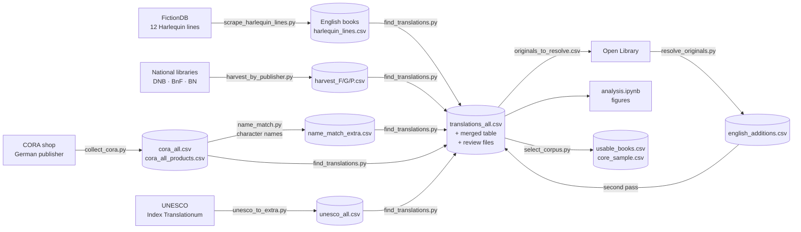
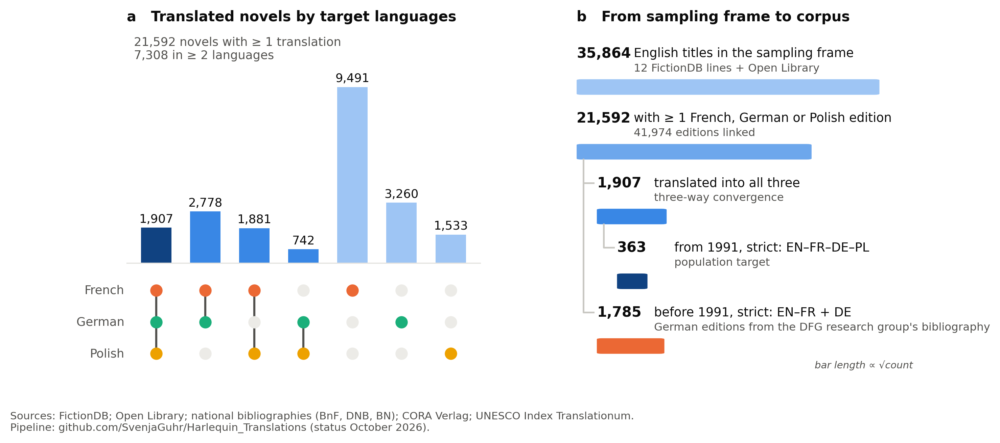
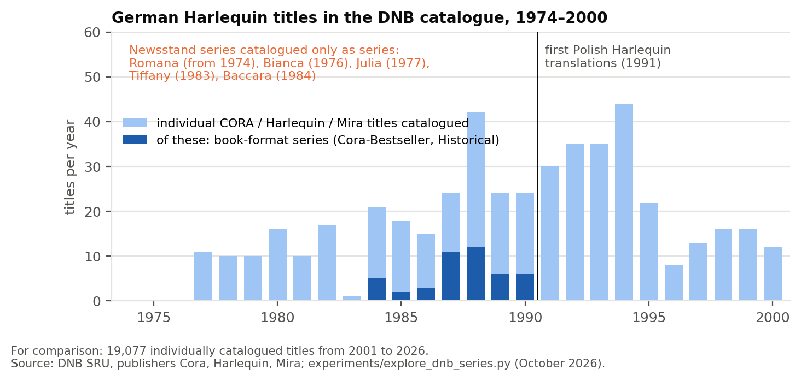

# Harlequin Translations

## Linking English category romances to their French, German and Polish editions

A reproducible pipeline that builds a metadata table of English-language Harlequin/Silhouette
category romances and links each book to its **French, German and Polish translations**, with
publication data, publishers, series, translators and stable edition IDs. It was built to select
parallel texts for a translation/alignment study, but the tables are useful for any
quantitative work on popular-fiction translation.

The pipeline works **translation-first**: instead of searching for translations of a fixed list of
English books, it harvests *every* Harlequin translation the national libraries hold and then
identifies the English original of each one.



---

## Contents

1. [Repository contents](#repository-contents)
2. [Installation](#installation)
3. [Quick start](#quick-start)
4. [The pipeline step by step](#the-pipeline-step-by-step)
5. [How matching works](#how-matching-works)
6. [Output files](#output-files)
7. [Results of the October 2026 run](#results-of-the-october-2026-run)
8. [Linking by character names](#linking-by-character-names)
9. [Corpus selection](#corpus-selection)
10. [Known limitations](#known-limitations)
11. [Negative results](#negative-result-german-translations-before-1991): German translations before 1991; linking by series order
12. [Data sources and responsible use](#data-sources-and-responsible-use)
13. [Development history](#development-history)

---

## Repository contents

| File | Purpose |
|---|---|
| `scrape_harlequin_lines.py` | English side: scrapes the complete lists of twelve Harlequin/Silhouette lines from FictionDB (optionally each book's detail page, incl. the description). |
| `harvest_by_publisher.py` | Harvests all Harlequin translations from the German (DNB), French (BnF) and Polish (BN) national libraries by **publisher**. |
| `collect_cora.py` | Collects German editions from the CORA Verlag shop (the German Harlequin publisher), whose product pages name original title and translator for every story; also saves every product's German blurb. |
| `unesco_to_extra.py` | Converts the open UNESCO *Index Translationum* sample into the pipeline's extra-source format. |
| `find_translations.py` | **Core.** Matches translations to English books, assigns edition IDs, writes the translation tables, the review files and the list of unresolved originals. Also holds the shared parsing/matching functions imported by the other scripts. |
| `resolve_originals.py` | Looks up English originals that are not in the scraped lines on Open Library and adds them if they are Harlequin-family books. |
| `name_match.py` | Links CORA products **without** an original title to their English book through the characters' names in the German blurb and the English description, with a built-in self-test. |
| `select_corpus.py` | Filters books available in all three languages (strict / relaxed) and draws a stratified sample for the study, with one edition per language to acquire. |
| `digitisation_tracker.ipynb` | Turns `core_sample.csv` into `digitisation_tracker.xlsx` (one row per volume, status columns for ordered / received / scanned / OCR checked, progress overview, reserve list), writes shopping lists per language, and explores the sample with figures. Re-running keeps everything entered in the spreadsheet. |
| `analysis.ipynb` | Analysis and figures: corpus overview, coverage per language and line, translation lag, publishers, translators, quality checks, shortlist of books available in several languages. |
| `experiments/explore_dnb_series.py` | Documented **negative result**: shows that the DNB catalogued CORA's newsstand series before 1991 only at series level (see below). |
| `experiments/anchor_candidates.py` | Documented **negative result**: an attempt to link records without original title via series order (see below). Not part of the pipeline. |
| `docs/img/` | Figures shown in this README |
| `requirements.txt`, `.gitignore` | Dependencies; keeps caches and data files out of the repository. |

All scripts must stay in the same folder (they import from `find_translations.py`). Run them from
the folder where you want the data files to be written.

---

## Installation

Python 3.10+.

```bash
git clone <this repository>
cd harlequin-translations
python -m venv .venv && source .venv/bin/activate      # optional
pip install -r requirements.txt
```

No API keys are needed. All sources are public web pages or open APIs.

---

## Quick start

Test runs that finish in minutes:

```bash
python scrape_harlequin_lines.py --lines american_romance          # 1,713 English books
python harvest_by_publisher.py --langs P                            # Polish translations (~10 min)
python find_translations.py harlequin_lines.csv --no-library --langs P \
    --extra harvest_P.csv -o translations_P.csv --merged merged_P.csv \
    --unmatched unmatched_P.csv --candidates candidates_P.csv
```

---

## The pipeline step by step

Every script **caches** each downloaded page (`cache/`, `cache_harvest/`, `cache_cora/`,
`cache_translations/`, `cache_openlibrary/`). Any step can be stopped and restarted; re-running
after a code change only re-parses the cached pages. On macOS, prefix long runs with
`caffeinate -i` to keep the machine awake.

### Step 1: English books (FictionDB)

```bash
python scrape_harlequin_lines.py                    # all twelve lines, list pages only (~10 min)
python scrape_harlequin_lines.py --details          # + every book page: rating, ISBN, pages, description (~17 h)
python scrape_harlequin_lines.py --lines presents desire   # a subset
```

| Line | Books (2026) |
|---|---|
| Harlequin American Romance | 1,713 |
| Harlequin Presents | 4,508 |
| Harlequin Romance | 5,031 |
| Silhouette Desire | 3,001 |
| Special Edition (Silhouette/Harlequin) | 3,200 |
| Harlequin Intrigue | 2,452 |
| Harlequin Superromance | 2,155 |
| Harlequin Historical, Harlequin Temptation, Harlequin Blaze, Silhouette Romance, Silhouette Intimate Moments / Romantic Suspense | together ≈ 8,400 |
| **All twelve lines (books listed in several lines counted once)** | **30,500** |

All twelve lines are scraped by default; choose with `--lines` (e.g. `--lines presents desire intrigue`).
With `--details` the full run takes about 17 h without a cache.
The scraper checks that each page's heading matches the expected line and skips a line otherwise
(FictionDB resolves the numeric series ID, not the name in the address). Books from added lines
no longer need to be resolved via Open Library: after re-running steps 5–7 they are linked with
FictionDB dates, series numbers and line names.

A book listed in several lines is kept once; `line` is the first line it was found in, `all_lines`
lists every membership (`"Silhouette Desire #812; Harlequin Presents #1590"`).
`is_anthology` marks stories that share a series number within a line (e.g. three novellas in
one Christmas volume); `is_companion` marks unnumbered titles attached to a line.

Output: `harlequin_lines.csv`.

### Step 2: Harvest all translations from the national libraries

```bash
python harvest_by_publisher.py                     # all three languages (~1–1.5 h)
python harvest_by_publisher.py --langs G            # or one language per terminal, in parallel
```

| Language | Library | Interface | Publishers searched |
|---|---|---|---|
| German | Deutsche Nationalbibliothek (DNB) | SRU, MARC21-xml | Cora, Harlequin, Mira |
| French | Bibliothèque nationale de France (BnF) | SRU, UNIMARC | Harlequin |
| Polish | Biblioteka Narodowa (BN) | BN Data JSON API | Harlequin, Arlekin |

Result sets over 9,000 records are split by publication year. Records describing a *series*
rather than a book (e.g. "Bianca / Extra") are skipped. Each record becomes one row per English
original it names (anthologies → several rows); records without an original title are kept with
an empty `original_title`.

Outputs: `harvest_F.csv`, `harvest_G.csv`, `harvest_P.csv` (extra-source format, see below).

### Step 3: German publisher data (CORA)

```bash
python collect_cora.py harlequin_lines.csv -o cora_editions.csv        # products tagged with a known author
python collect_cora.py harlequin_lines.csv --all -o cora_all.csv       # the whole shop (overnight)
```

CORA product pages carry an impressum per story, e.g.

```
© 2009 by Cathy Gillen Thacker | Originaltitel: „Mommy for Hire" | erschienen bei: Harlequin Enterprises Ltd., Toronto
in der Reihe: AMERICAN ROMANCE | © Deutsche Erstausgabe in der Reihe: BIANCA | Band 1808 (24/1) 2011 | Übersetzung: Rainer Nolden
```

The collector extracts original title, translator, the original series (`original_series`) and the
**first German edition** (`first_edition`, `first_edition_year`), which e-book reissues state
explicitly. It also saves each product's German blurb (`blurb`), and writes `<output>_products.csv` listing *every* product read, including those without an original title. Author tags are matched tolerantly (a typo such as "Cathy Gillan Thacker" still matches).
The shop lists only titles currently on sale. The whole-shop run (October 2026) read 14,870
products: 4,278 stories with an original title (`cora_all.csv`) and 12,385 products without one,
which step 7a links by character names.

### Step 4: UNESCO Index Translationum (optional)

Download the open export (`tran001`) from the [UNESCO Data Hub](https://data.unesco.org/explore/dataset/tran001/)
as `index_translationum.csv`, then:

```bash
python unesco_to_extra.py harlequin_lines.csv index_translationum.csv -o unesco_all.csv
```

The open dataset is a *sample* (≈26,000 works, 1978–2008) without an author column; entries are
matched by exact title and kept only for romance publishers and plausible years. Rows are marked
"title-only match".

### Step 5: Matching, first pass

```bash
python find_translations.py harlequin_lines.csv --no-library \
  --extra harvest_F.csv harvest_G.csv harvest_P.csv cora_all.csv unesco_all.csv \
  -o translations_all.csv --merged harlequin_lines_with_translations.csv \
  --unmatched unmatched_all.csv --candidates candidate_matches_all.csv
```

`--no-library` skips the older per-author library searches, which the publisher harvest replaces.
(Without it, the script queries all three libraries author by author: slow, but useful for a
small author list.)

Besides the tables described below, this writes `originals_to_resolve.csv`: English originals that
translations point to but that are not in `harlequin_lines.csv` (other lines, single titles).

### Step 6: Resolve originals outside the scraped lines (Open Library)

```bash
python resolve_originals.py originals_to_resolve.csv      # ~1 request/s; ~16,000 titles ≈ 5–8 h
```

A result is accepted only if the title is the same book (see matching rules), the author matches,
and at least one edition appeared under a Harlequin-family imprint (Harlequin, Silhouette,
Mills & Boon, Mira, HQN, Love Inspired, …). Output: `english_additions.csv` (same columns as
`harlequin_lines.csv`, `line = "Other Harlequin (via Open Library)"`, `book_id` = Open Library
work ID such as `OL999W`).

### Step 7: Matching, second pass

The same command as step 5 with both English tables:

```bash
python find_translations.py harlequin_lines.csv english_additions.csv --no-library \
  --extra harvest_F.csv harvest_G.csv harvest_P.csv cora_all.csv unesco_all.csv \
  -o translations_all.csv --merged harlequin_lines_with_translations.csv \
  --unmatched unmatched_all.csv --candidates candidate_matches_all.csv
```

### Step 7a: Link CORA products without original title (character names)

```bash
python name_match.py harlequin_lines.csv cora_all_products.csv
```

Prints the self-test, then writes `name_match_new.csv` (every accepted match with the shared names,
score and margin, for checking) and `name_match_extra.csv` (extra-source format). Add the latter to
the matching command:

```bash
python find_translations.py harlequin_lines.csv english_additions.csv --no-library \
  --extra harvest_F.csv harvest_G.csv harvest_P.csv cora_all.csv unesco_all.csv name_match_extra.csv \
  -o translations_all.csv --merged harlequin_lines_with_translations.csv \
  --unmatched unmatched_all.csv --candidates candidate_matches_all.csv
```

See [Linking by character names](#linking-by-character-names). Requires the descriptions from
`scrape_harlequin_lines.py --details`.

### Step 8: Manual review (optional)

`candidate_matches_all.csv` suggests English books for records that could not be matched
automatically. Put `y` in the `confirm` column for correct rows, save, and re-run step 7.
Confirmed rows enter the tables with `match_score = manual`; your marks survive re-runs.
Review only `high` and `medium`; `low` is mostly noise (see below).

### Step 9: Analysis

Open `analysis.ipynb`, set `DATA_DIR` in the first code cell, **Restart & Run All**.
Figures go to `figures/`, derived tables (incl. `alignment_candidates.csv`) to `output/`.

### Step 10: Corpus selection

```bash
python select_corpus.py                       # 250 books, strict, two periods (split 1991), even by decade and line
python select_corpus.py --decades proportional --lines proportional   # follow availability
python select_corpus.py -n 300 --level relaxed
python select_corpus.py --prefer earliest     # first translations also from 1991 on
python select_corpus.py --split-year 0        # no split: EN-FR-DE-PL for every book
```

Outputs `usable_books.csv` (every usable book with its period, level and languages) and `core_sample.csv` (the sample, with title, year, ISBN, series and translator of one
edition per language). See [Corpus selection](#corpus-selection).

### Step 11: Digitisation tracker

Open `digitisation_tracker.ipynb`, set `DATA_DIR`, **Run All**. It writes
`digitisation_tracker.xlsx`, `shopping_lists/shopping_<language>.csv`, `order_first.csv` (books with
only one edition in every language) and figures to `figures_sample/`. Fill in the yellow columns
of the spreadsheet as you work; re-running the notebook rebuilds the file, keeps your entries
(the previous file is kept as a dated backup) and updates the progress figures.

---

## How matching works

### Normalisation

Titles are compared after lower-casing, removing accents, punctuation, bracketed text, leading
articles (*the/a/an*), trailing years (`"Now and forever, 1983"`), and everything after
` / `, ` ; `, ` = ` or ` // ` (author statements, series, parallel titles, FictionDB double titles).
Library non-sorting markers (e.g. U+0098/U+009C around *Das* in DNB records) are stripped.

### Same book or not?

Harlequin titles are formulaic, so string similarity alone produces false matches
(*The Texas Cowboy's **Quadruplets*** vs. ***Triplets***). Two titles count as the same book only if

- they are identical after normalisation, **or**
- they differ only in minor words (*a, an, the, and, of, for, to, in, on, with, s*) and numbers
  (*"Love Potion #5"* = *"Love potion"*), **or**
- each differing word is a spelling variant: same first letter and a plural/possessive ending
  or a one-letter edit (*honour/honor, Trouble/Troubles, protégée/protogee*); *billion/million*
  and *baby/cowboy* are rejected, **or**
- words are only joined or split (*"cow boy's"* = *"cowboy's"*), **or**
- one title (≥ 3 words) is contained in the other and makes up ≥ 60 % of it.

Matching is always within the **same author** (names compared without accents; small typos
tolerated). Anthology stories (`"Volume: Story"`) also match on either part alone.

### What counts as an English original

Libraries sometimes record Polish/German titles in the same field as the original (Polish
anthologies list their stories' Polish titles). Candidate originals containing Polish or German
letters or typical Polish/German words and endings are discarded; all 1,713 American Romance
titles pass this filter.

### Edition IDs

| Pattern | Meaning | Example |
|---|---|---|
| `<book_id>_<L>` | the only edition in language L | `6157_P` |
| `<book_id>a_<L>`, `b`, `c`, … | several editions, `a` = earliest | `6157a_G`, `6157b_G` |

`L` = `F` (French), `G` (German), `P` (Polish). `book_id` is the FictionDB book ID or an Open Library
work ID (`OL999W`).

### Review file confidence

| Level | Meaning |
|---|---|
| `high` | The record names an English title that is the same book by the rules above, but it was not matched automatically. |
| `medium` | The record names **no** original title; romance publisher, published 0–15 years after the original, and at most two books by the author are plausible. |
| `low` | Everything else (typically prolific authors with 20+ plausible books). |

---

## Output files

### `translations_all.csv`: one row per translated edition

| Column | Content |
|---|---|
| `translation_id` | Edition ID (see above) |
| `book_id` | English book (FictionDB ID or Open Library work ID) |
| `language_letter`, `language` | F/G/P, French/German/Polish |
| `original_title`, `author` | English book as listed in the English table |
| `translated_title` | Title of the translated edition (for anthologies: the volume title) |
| `pub_date`, `pub_year`, `publisher`, `place` | Imprint of the translated edition |
| `translators` | Translator(s), "First Last" |
| `series` | Series/collection and number of the edition (e.g. `Harlequin. Désir 2`, `Bianca 1808`) |
| `isbn` | ISBN(s) of the edition |
| `source`, `source_record_id` | DNB / BnF / BN / CORA / CORA (name match) / UNESCO and the record ID or URL |
| `original_title_in_record` | Original title(s) exactly as the source records them |
| `match_score` | 1.0 exact; 0.88–0.99 variant; `manual` = confirmed in review |
| `edition_type`, `works_in_edition` | `single` or `anthology`, and the number of works in the volume |
| `first_edition`, `first_edition_year` | First edition in that language, where the publisher states it (CORA) |
| `original_series` | Original English line, where the publisher states it (CORA) |

### Other files

| File | Content |
|---|---|
| `harlequin_lines_with_translations.csv` | English table joined to editions (columns prefixed `tr_`); one row per edition, books without translation kept once |
| `unmatched_all.csv` | Target-language records not linked, with `reason` (*no original title in record* / *title did not match*) and the closest title |
| `candidate_matches_all.csv` | Review file (see step 8) |
| `originals_to_resolve.csv` | English originals not in the input tables, with how many editions point to them |
| `english_additions.csv` | Originals resolved via Open Library |
| `cora_all_products.csv` | Every CORA product read, with German blurb and the original titles found (if any) |
| `name_match_new.csv`, `name_match_test.csv` | Accepted character-name matches; the self-test with every prediction |
| `usable_books.csv`, `core_sample.csv` | Books in all three languages; the stratified sample |
| `harvest_*.csv`, `cora_*.csv`, `unesco_all.csv` | Source data in **extra-source format**: `language_letter, authors, original_title, translated_title, pub_date, publisher, place, translators, series, isbn, format, copyright, source, source_record_id, url` (+ optional `original_series, first_edition, first_edition_year`). Any other source converted to this format can be added with `--extra`. |

---

## Results of the October 2026 run

English side: **30,500 books** from twelve FictionDB lines plus **5,364** Harlequin-family
originals identified through Open Library (**35,864 books**). Sources on the translation side:
publisher harvest from the three national libraries, the complete CORA shop, the UNESCO sample.

| | French | German | Polish |
|---|---|---|---|
| **Linked editions** | **19,021** | **5,950** | **6,585** |
| **English books with ≥ 1 edition** | **16,057** | **4,619** | **6,063** |
| Translator named (books in all three languages, strict) | 42 % | 84 % | 100 % |

In total **31,556 translated editions** of **19,978 English books**. Adding the character-name
matches (step 7a) raises the German editions to **16,368** (41,974 editions in total) and the
German books to **8,687**; see [Linking by character names](#linking-by-character-names).



*(a) English Harlequin novels by the combination of target languages they were translated into (incl.
character-name matches). (b) From the sampling frame to the corpus: from 1991 novels translated into
all three languages; before 1991 (no Polish Harlequin translations) English–French pairs, with German
editions to be added from the bibliography of the DFG Research Group "Medium – Ware – Werk".*

**Books by language combination:**

| Languages | Catalogue + publisher data | + character-name matches |
|---|---|---|
| French only | 10,749 | 9,491 |
| Polish only | 1,866 | 1,533 |
| German only | 1,646 | 3,260 |
| French + Polish | 2,744 | 1,881 |
| French + German | 1,520 | 2,778 |
| German + Polish | 409 | 742 |
| **French + German + Polish** | **1,044** | **1,907** |
| Books with ≥ 1 translation | 19,978 | 21,592 |

Development of the result:

| Stage | Editions | German | In all three languages |
|---|---|---|---|
| American Romance, author search | 224 | | |
| + CORA (author-tagged products), UNESCO | 305 | | |
| Five lines, publisher harvest (first pass) | 13,906 | | |
| + originals resolved via Open Library | 28,243 | 3,324 | 634 books |
| + complete CORA shop | 30,693 | 5,779 | |
| + seven more FictionDB lines | **31,556** | **5,950** | **1,044 books** |
| + character-name matches | 41,974 | 16,368 | 1,907 books |

Adding the seven lines changed the total only slightly but replaced about 5,000 Open Library
records by FictionDB records with exact dates, line, series number and description: the
originals that had to be resolved via Open Library fell from 16,640 to 11,104
(5,364 found, 939 not Harlequin, 4,775 not found).

> **How to read coverage.** Books added through Open Library were found *because* a translation
> points to them, so every one of them has at least one translation. Shares computed over all
> English books are therefore inflated. For unbiased coverage, use the scraped lines only
> (`analysis.ipynb`, section 4.8, *coverage by line*).

---

## Linking by character names

Translators rewrite titles, but they almost never rename the characters. `name_match.py` uses this
to link CORA products whose page gives **no** original title:

1. **English side:** capitalised words in each FictionDB description that are not sentence-initial
   and not common English words are name candidates. Each gets an IDF weight: *Moustakas* counts
   far more than *Jack* or *Texas*.
2. **German side:** anthology blurbs are split into one segment per story (`TITEL von AUTOR …`, or
   story titles in capitals). German capitalises all nouns, so only words that also occur as names
   on the English side are used.
3. **Score** of an English book = sum of the weights of the shared names. If the author is known
   (from the segment or the product's author tag), only that author's books compete.
4. A match is accepted if the score is high enough **and** clearly ahead of the second-best book
   (margin). Thresholds are chosen from the self-test for ≥ 98 % precision.

**Self-test.** CORA products *with* an original title serve as test data (1,428 products,
2,395 stories). Only products where every story's original is known are used: CORA often names
fewer originals than an anthology contains, and testing on those marks correct answers as wrong
(first, flawed run: ≈ 65 % "precision"; manual inspection showed most "errors" were correct).

| Setting | Precision | Coverage |
|---|---|---|
| Author known (score ≥ 10, margin ≥ 5) | **98 %** | 78 % |
| Author known (margin ≥ 8) | 99 % | 67 % |
| Names only (score ≥ 15, margin ≥ 10) | **98 %** | 30 % |

Typical remaining error: another volume of the same family saga (the Caffarelli or Stathakis
brothers share a surname and often the setting).

**Result.** Of 12,385 products without an original title, 11,010 story segments in 7,656 products
were matched (6,401 distinct English books); 10,418 were linked by `find_translations.py`.
German books rose from 4,619 to 8,687, books in all three languages from 1,044 to 1,907.
Most of these products are e-books (6,855) or audiobooks (247), only 554 print: they prove that a
German translation exists, but their date is the shop date, not the first German edition.
Name matches therefore count only at the *relaxed* level in `select_corpus.py`.

---

## Corpus selection

Harlequin translations into Polish begin only in **1991**, so `select_corpus.py` works with two
periods, defined by the year of the English edition (default `--split-year 1991`; English editions
before 1970 are left out, `--min-year`, because the French and German programmes start in the late 1970s):

| Period | Study unit | Requirement |
|---|---|---|
| **before 1991** | EN–FR and/or EN–DE | a French and/or German translation published **before 1991** (contemporaneous); books with both are preferred |
| **from 1991** | EN–FR–DE–PL | a French, a German **and** a Polish translation |

The translation date is the edition's publication year, or the first German edition where the
CORA imprint states it ("Deutsche Erstausgabe … 1987").

Two levels of evidence:

| Level | Condition for each required edition | English original |
|---|---|---|
| **strict** | contains only this novel (no anthology), linked by an exact original title or by hand, from catalogue/publisher data (not from name matching) | from FictionDB (exact date and line) |
| **relaxed** | any linked edition (anthologies, title variants ≥ 0.88, character-name matches) | FictionDB or Open Library |

Results (October 2026):

| | Before 1991 (EN–FR / EN–DE) | From 1991 (EN–FR–DE–PL) |
|---|---|---|
| **strict** | **1,785** books: FR only 1,778, FR+DE 3, DE only 4 | **363** books (117 with all translators named) |
| relaxed | 2,221 books: FR only 2,204, FR+DE 4, DE only 13 | 1,860 books (268 with all translators named) |

**German before 1991 is a catalogue gap, not a market gap.** CORA published Harlequin's category
novels in newsstand series from the 1970s, but the Deutsche Nationalbibliothek catalogued these
series only at series level, so no individual title before 1991 is recorded (see
[Negative result: German translations before 1991](#negative-result-german-translations-before-1991)).
CORA's first-edition statements do not reach back that far either. Only 7 strict German translations
before 1991 can be linked; the early period is therefore, in the data, an EN–FR period.

**Sample.** The default sample (250 books) is spread evenly across the decades of the English
edition and, within each decade, across lines; decades or lines with too few books pass their
surplus on (`--decades proportional`, `--lines proportional` follow availability instead).
Within each cell, early books with both French and German come first, then books whose
translators are all named. For early books the earliest edition before 1991 is listed for
acquisition; for later books a single-novel edition naming its translator (`--prefer earliest`
for the first translation).

| | Books | Volumes incl. English |
|---|---|---|
| before 1991 (EN–FR 105, EN–FR–DE 3) | 108 | 219 |
| from 1991 (EN–FR–DE–PL) | 142 | 568 |
| **total** | **250** | **787** |

By decade: 1970s 42, 1980s 42, 1990s 42, 2000s 41, 2010s 42, 2020s 41. By line: Harlequin Presents 78,
Silhouette Desire 50, Harlequin Romance 40, Silhouette Romance 14, Harlequin Historical 13,
Special Edition 12, Superromance 9, American Romance, Intrigue, Temptation and Intimate Moments 8 each,
Blaze 2. 154 books have all translators named; the others are taken from the imprint page during
digitisation (column `translator_imprint` in the tracker, step 11).

Figures of the sample (composition, translators, translation lag, editions per book) are produced
by `digitisation_tracker.ipynb` in `figures_sample/`.

---

## Known limitations

- **French catalogue gap 1984–1987.** The BnF holds the Harlequin editions of these years
  (288–528 records per year) but records the original title for only 2–17 % of them
  (83–100 % before and after). About 1,700 French editions therefore cannot be linked from
  catalogue data; this produces a visible dip for originals from 1983–1986.
- **German before 1991.** CORA's newsstand series (Romana from 1974, Bianca from 1976, Julia from
  1977, Tiffany, Baccara) are catalogued by the DNB only at series level; not one of their issues before
  1991 is recorded individually (see the negative result below). The CORA shop lists only current
  titles, whose first editions are also recent. German coverage before 1991 is therefore close to zero.
- **"Original year" is the North American Harlequin edition** (FictionDB). Titles by British
  authors appeared first with Mills & Boon, often 1–2 years earlier, and were translated from that
  edition: 202 editions (FictionDB years) predate "their original" by 1–2 years. These are real;
  translation lag is slightly underestimated for UK-origin titles.
- **Open Library years are unreliable.** Its "first published" year is often a later reissue or
  e-book (e.g. *The Tower of the Captive*, Violet Winspear: 2016). 611 editions of Open Library
  books appear to predate their original, 329 by 6+ years; the matches themselves are correct.
  The notebook therefore estimates these books' year as the earlier of the Open Library year and
  the earliest translation, and excludes them from lag statistics.
- **Records without an original title** (≈ 15,000 German, mostly magazine-format novels) can only
  be linked by manual review or other sources (e.g. the copyright page of the printed book).
  For CORA products, character-name matching closes much of this gap (see above).
- **French minimal records.** Many BnF records of Harlequin paperbacks are dépôt-légal minimal
  records: title, author, imprint, collection and number, but **neither original title nor
  translator**. Share of harvested French records naming a translator: 1980s 4 %, 1990s 5 %,
  **2000s 0 %** (4 of 6,163), 2010s 13 %, 2020s 27 %. Among the books strictly attested in all
  three languages, the translator is named for 42 % of French, 84 % of German and 100 % of Polish editions. Missing translators
  must be taken from the imprint page of the printed book.
- **CORA original titles in anthologies** are sometimes incomplete (fewer originals than stories).
- **Transediting.** Translated titles are routinely rewritten and cannot be used to identify the
  original; the pipeline never matches on the translated title.
- **Share of corpus** is computed against all English books, including 1949–1977 Harlequin
  Romance titles published before the French, German and Polish programmes existed.
- **Pen names** differing between original and translation are not resolved.
- **UNESCO data** is an open sample without authors; matches are title-only and marked as such.
- **FictionDB list pages** give year only for some early titles and no page counts; use
  `--details` if these fields matter.

---

## Negative result: German translations before 1991

`experiments/explore_dnb_series.py` checked why German translations before 1991 are practically absent
from the linked data. Three findings (DNB, publishers Cora / Harlequin / Mira, October 2026):

1. **The newsstand series are catalogued as periodicals.** The DNB holds one series record each for
   Romana (from 1974), Bianca (1976), Julia (1977), Tiffany (1983), Baccara (1984), Historical (1986)
   and short-lived series such as Denise, Natalie or Love Affair (1,964 series records in total,
   skipped by the harvest because they do not describe a book).
2. **Hardly any individual titles before 1991.** The DNB records 10–40 individual CORA books per year
   in the 1980s, against more than 19,000 from 2001 on.
3. **A direct search by series name, regardless of publisher,** finds 45 individual CORA titles for
   1970–1990, all in the two *book-format* series Cora-Bestseller (Nr. 1–33, 1984–1990) and Historical
   (Bd. 1–19, 1986–1989); 29 name an original title, mostly single titles licensed from other
   American publishers rather than Harlequin category novels (e.g. *Whitney, My Love*). The
   newsstand series Julia, Romana, Bianca, Baccara and Tiffany have **no** individually catalogued
   issue before 1991.



Neither CORA's shop (first-edition statements: none before 1991) nor matching German titles of later
reissues can close the gap, since the first editions themselves are not recorded. A German strand for
the 1970s and 1980s needs sources beyond library catalogues: the publisher's licence records, or the
issues themselves, whose imprints name original and translator.

```bash
python experiments/explore_dnb_series.py      # writes dnb_series_records.csv, dnb_issue_search.csv
```

---

## Negative result: linking by series order

`experiments/anchor_candidates.py` tested whether translations *without* an original title can be
linked through their position in the foreign collection: between two "anchor" records whose
original is known, the missing numbers should correspond to English books between the two anchor
originals, in the same order and by the same author. Every known link was hidden once and
predicted from the others (leave-one-out self-test):

| | Tested | Best guess right | "Unique" predictions right |
|---|---|---|---|
| French, anchors ≤ 10 numbers apart | 2,391 | 22 % | 41 % |
| German, anchors ≤ 10 numbers apart | 87 | 53 % | 67 % |
| Best single collection (Azur → Harlequin Presents) | 114 | – | 54 % |

No collection reached the 95 % threshold. French and German Harlequin collections did **not**
reproduce the English publishing sequence, even within one line: foreign editors selected,
reordered and mixed titles across lines. The method is therefore not used in the pipeline; the
script is kept to document and reproduce the test:

```bash
python experiments/anchor_candidates.py --lang F      # prints the self-test and per-collection table
```

---

## Data sources and responsible use

| Source | Used for | Access |
|---|---|---|
| [FictionDB](https://www.fictiondb.com/) | English series lists and book metadata | Web pages |
| [Deutsche Nationalbibliothek](https://services.dnb.de/sru/dnb) | German editions | SRU, MARC21-xml |
| [Bibliothèque nationale de France](https://catalogue.bnf.fr/api/SRU) | French editions | SRU, UNIMARC |
| [Biblioteka Narodowa, BN Data](https://data.bn.org.pl/docs/bibs) | Polish editions | JSON API |
| [CORA Verlag](https://www.cora.de/) | German editions, translators, first editions | Shop pages |
| [UNESCO Index Translationum](https://data.unesco.org/explore/dataset/tran001/) | Translations 1978–2008 (sample) | Open data export |
| [Open Library](https://openlibrary.org/developers/api) | English originals outside the scraped lines | Search API |

- All scripts pause between requests (`--delay`, default 1–1.5 s), retry politely on errors and
  cache every response so nothing is downloaded twice. Please keep these settings.
- Check each source's terms of use before large runs and before **redistributing data**. This
  repository publishes code only; `.gitignore` excludes caches and all generated CSV files.
  Library catalogue data is published under open licences by several of these institutions;
  verify the licence of each source before sharing derived tables.

---

## Development history

How the method evolved; useful for understanding design decisions:

1. **One series, author search.** Scrape Harlequin American Romance (1,713 books) from FictionDB
   and query DNB/BnF/BN author by author, matching the original title recorded in each catalogue
   record → 224 editions.
2. **Matching refinements.** Strip library sorting markers; read more note fields ("Trad. de",
   "Titre original", "Originaltitel", "Tyt. oryg."); tolerate trailing years and author statements;
   add a review loop (`candidate_matches.csv`) for unmatched records.
3. **False positives.** Similar-looking but different titles (*Quadruplets/Triplets*,
   *Baby/Cowboy for Christmas*) were being suggested → word-level "same book" rules replaced
   plain string similarity.
4. **More sources.** CORA shop (German publisher data, translators, first editions) and the UNESCO
   sample → 305 editions.
5. **Scope.** From one series to five lines (17,452 books), then **translation-first**: harvest
   all Harlequin translations by publisher → 13,906 editions; resolve unknown originals via
   Open Library (+9,965 English books) → 28,243 editions.
6. **More German data.** Complete CORA shop (14,870 products) → German editions 3,324 → 5,779;
   twelve FictionDB lines (30,500 books) → 31,556 editions, 1,044 books in all three languages.
7. **Character-name matching** for CORA products without original title (98 % precision in the
   self-test) → 16,368 German editions.
8. **Corpus selection** (`select_corpus.py`): two periods (no Polish Harlequin translations before
   1991): 1,785 strict EN–FR/EN–DE sources before 1991, 363 strict EN–FR–DE–PL sources from 1991;
   250-book sample spread evenly across decades (787 volumes).
9. **Data quality fixes found on real data.** Series records mistaken for books; a Polish-only
   "title / title" rule applied to other libraries; Polish note-label spellings; Polish story
   titles stored as originals; French sub-collections (*Harlequin. Désir 2*).
10. **Tested and rejected:** linking by series order; recovering German translations before 1991 from
    the DNB, which catalogued CORA's newsstand series only at series level (see *Negative results*).
